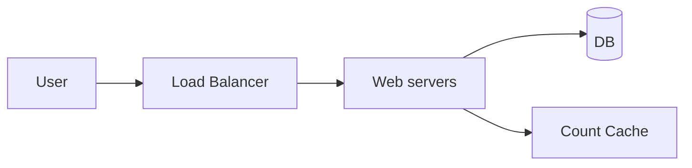
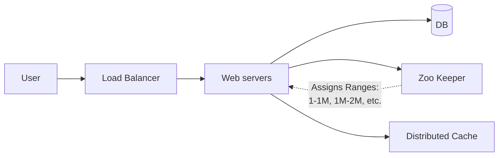

# TinyURL HLD Practice

This file defines the TinyURL HLD based on the Excalidraw design and is intended for quick revision.

## 1. Problem
Design a URL shortener service like TinyURL that takes a long URL and generates a short URL, and redirects users from the short URL to the original long URL.

## 2. Requirements

### Functional
- POST /create-url
- GET /{short-url}

### Non-functional
- POST: low latency
- GET: high availability

## 3. Scale
- 1000 writes/sec
- 10:1 read:write ratio
- ~31.5B URLs/year
- ~300B reads/year

## 4. API contract

### POST /create-url
- Request: long-url
- Response: 201 Created
- Returns short-url

### GET /{short-url}
- Response: 301 Permanent Redirect
- Redirects to long-url

## 5. Data model
- long-url: string
- short-url: string
- created-at: timestamp
- Optional: created-by / expiry

## 6. Design notes
- Short key generation using Base62
- Alphabet: a-z, A-Z, 0-9 (62 chars)
- 6 chars gives ~56B combinations; 7 chars gives ~3.5T
- Use distributed ID/counter for uniqueness
- Cache hot mappings in Redis
- Primary DB for persistence
- GET uses cache first, DB fallback

### Zoo-keeper Approach
- Zoo keeper basically assignes each server a particular ID range, this is how uniqueness is ensured currently.
- Also the Zookeeper will have less frequent calls since a server will only reach out to it when its 1 mil range is over. Unlike in case of count cache where the server just reaches out for each id causing collisions.
- Servers have seperate pools assigned to pick from (e.g. 1 - 1million, 1mil - 2mil, 3mil - 4 mil, 4mil - 5mil).

## 7. Architecture / core flow

### Count cache approach

### Zoo-keeper Approach (Design Flow)

### POST Flow
1. Request comes to generate a short URL
2. Request is checked in cache
3. Server gets the range from the Zoo Keeper
4. Saves it to the DB and updates the cache
5. Returns to the user

### GET Flow
1. Request comes with the short URL
2. Request is checked in cache if present returned
3. If not present checked in DB and written in cache and returned to the user

## 8. Trade-offs and risks

### Count cache approach
- This is a SPOF and if the cache is down functionality goes down.
- Even if multiple caches and web servers are generated this will create further complications like collisions.
- Server A got the ID 10, while Server B was requesting at the same time and got the ID 10.

### Zoo-keeper approach
- Again if this is a SPOF multiple instances of Zookeeper can be maintained.

## 9. Failure handling
- If a zookeeper fails the moment request comes, that range is dropped and the next range is assigned when it becomes available again. Since we have around 3.5 Trillion available unique URLs this is enough even if a 1 mil range is dropped.

## 10. Interview talking points (Additional Considerations)
- **Analytics**: Counts for each URL to determine which short URL to cache. IP address to store location information to determine where to locate the caches etc.
- **Rate Limiting**: To prevent DDOS attacks.
- **Security Considerations**: Add random suffix to the short URL to prevent hackers from predicting the URLs. Note - This is a tradeoff to the URL length to prevent the predictability.

## 11. Excalidraw reference
`TinyURL_HLD_canvas.excalidraw`
