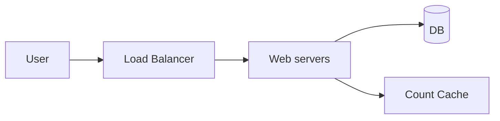
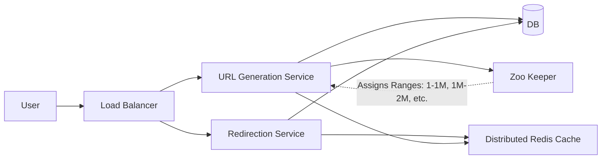

# TinyURL HLD Practice

This file defines the TinyURL HLD based on the Excalidraw design and is intended for quick revision.

## 1. Problem
Design a URL shortener service like TinyURL that takes a long URL and generates a short URL, and redirects users from the short URL to the original long URL.
- optionally support custom alias
- optionally support an expiration time

## 2. Requirements

### Functional
- Create a short url from a long URL (POST /urls or /api/v1/shorten)
    - optionally support custom alias
    - optionally support an expiration time
- Be redirected to the original url from the short url (GET /{short-url})

### Non-functional
- Low latency on redirects (~200 ms or sub-50ms)
- Support 100M DAU and 1 billion URLs
- Ensure uniqueness of short code
- High availability, eventual consistency for url shortening

## 3. Scale
- 1000 writes/sec (35,000 QPS read)
- 10:1 read:write ratio
- ~31.5B URLs/year
- ~300B reads/year

## 4. API contract

### POST /api/v1/shorten
- Request: 
  ```json
  {
      "originalUrl": "string",
      "alias": "string (optional)",
      "expirationTime": "timestamp (optional)"
  }
  ```
- Response: 201 Created
- Returns shortUrl

### GET /{shortURL}
- Response: 301 Permanent or 302 Temporary Redirect
- Redirects to original URL

## 5. Data model (URL Table)
- shortUrl/customAlias: string
- longUrl: string
- expirationTime: timestamp
- creationTime: timestamp
- userId: string

## 6. Design notes & Approaches for Short URL Generation

### Requirements for Short Code
- Fast
- Unique
- Short (5-7 chars)

### Approaches
1. **Prefix of the long URL**: Bad approach as many will share common prefix.
2. **Random number generator (10^9)**: Base 62 encoding (0-9, A-Z, a-z). 62^6 = 56 Billion. Collision probability is still high (Birthday Paradox: 23 people in a room, >50% chance of same bday). Need to check for collision first. (ByteByteGo discusses this approach).
3. **Hash the long URL**: md5(long url) -> hash -> [truncate to 6 characters] -> base62(hash). Still need to handle collisions. UUID required.
4. **Counter**: Incrementing a counter -> calculate base62. E.g., 11157 resolves to 2TX. 
   - No need to check for collisions.
   - Drawback: Predictability (bad for security). 
   - Prevention: Warn users not to shorten private URLs, use rate limiting (so hackers can't scrape URLs), use a bijective function (e.g. sqids.org) that maps a number to a base62 string. (Recommended by Hello Interview).
5. **Zookeeper Approach (Evolved from 4)**: Counters are assigned to servers in ranges (e.g., Server 1 gets 1-1M, Server 2 gets 1M-2M). Uniqueness is ensured. Less frequent calls to Zookeeper. 

## 7. Architecture / core flow

### HLD Service Breakdown
- **URL Generation Service (Primary Server)**: Handles all write operations. Validates incoming URLs, generates unique short code, handles custom aliases, stores metadata. Low write traffic, doesn't need to scale aggressively.
- **Redirection Service**: Handles overwhelming majority of traffic (billions of GET requests). Fast, stateless, horizontally scalable. Looks up original URL, checks validity, issues 301/302 redirect. Caches frequently accessed mappings.

### Count cache approach



### Zoo-keeper Approach (Design Flow)



### POST Flow (Write)
1. Client sends a POST `/api/v1/shorten` request with the long URL.
2. The Load Balancer routes the request to a URL Generation Service instance.
3. The service validates the URL format and generates a unique short code (using Zookeeper range).
4. The service stores the mapping (short_code -> long_url) in the Database.
5. The service returns the complete short URL to the client.

### GET Flow (Read)
1. Client requests GET `/{short-url}`.
2. The Load Balancer routes to a Redirection Service instance.
3. The service first checks the Redis Cache (LRU, Read-through, key: shortCode, value: longUrl).
4. On cache hit, return the long URL immediately.
5. On cache miss, query the Database, then populate the cache.
6. The service validates the link is not expired.
7. Return an HTTP 302 redirect to the original URL.

## 8. Trade-offs and risks

### 301 vs 302 Redirects
- **301 (Permanent)**: We store the generated URL in a cache for future use (in browser), no regeneration, no scaling of the server, always hits the browser cache, less compute cost, no analytics.
- **302 (Temporary)**: Analytics can be done, requests hit the server and we can analyze the frequently queried, cost involved, more servers needed.
- **Verdict**: 302 is best here because even if we don't show the users the analytics, we track this internally. If something breaks, we can debug easily.

### Count cache approach
- This is a SPOF and if the cache is down functionality goes down.
- Even if multiple caches and web servers are generated this will create further complications like collisions (e.g. Server A got the ID 10, while Server B was requesting at the same time and got the ID 10).

### Zoo-keeper approach
- If this is a SPOF, multiple instances of Zookeeper can be maintained.

## 9. Failure handling
- If a zookeeper fails the moment a request comes, that range is dropped and the next range is assigned when it becomes available again. Since we have around 3.5 Trillion available unique URLs, this is enough even if a 1 mil range is dropped.

## 10. Interview talking points (Additional Considerations)
- **Analytics**: Counts for each URL to determine which short URL to cache. IP address to store location information to determine where to locate the caches etc.
- **Rate Limiting**: To prevent DDOS attacks.
- **Security Considerations**: Add random suffix to the short URL to prevent hackers from predicting the URLs. Note - This is a tradeoff to the URL length to prevent predictability.

## 11. Excalidraw reference
`URLShortner.excalidraw`
