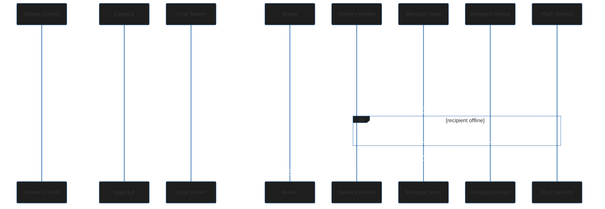
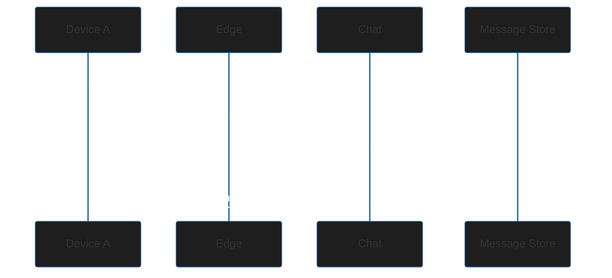

 # WhatsApp HLD

This file mirrors the `WhatsApp.excalidraw` panel and is intended for quick interview revision. It preserves the Excalidraw text and adds dark-mode-friendly Mermaid diagrams for architecture and core flows.

## 1. Functional Requirements
- 1:1 chats and group chats (up to 500 members)
- Delivery status (sent, delivered, read)
- Last-seen / presence (online, offline, last seen time)
- Message history sync across multiple devices
- Push notifications for new messages
- Send/receive media messages (images, videos, voice notes)

## 2. Non-functional Requirements
- Low latency for online users. Target P99 < 100 ms when recipient is online
- High availability (>= 99.99% uptime)
- Reliability: messages should not be lost
- Scalability: support 500M+ DAU and 20B+ messages/day
- Correct ordering of messages
- Strong consistency semantics where required (avoid duplicates)
- Fault tolerance

## 3. Out of scope (for this design)
- Voice/Video calls
- End-to-end encryption (E2E)
- Stories / Status updates

## 4. Back-of-the-envelope estimation (from Excalidraw)
- Daily active users (DAU): 500M
- Messages per day per user: 40 → total ~20B+ messages/day
- Messages/sec: 20B / 86400 ≈ 230,000 msg/s (average)
- Peak factor ~3x → ~700,000 msg/s peak

### Connections
- WebSockets are used for online presence and real-time delivery
- Assume 10% of DAU online concurrently → 50M concurrent connections
- If a single server supports ~50k connections, need ~1k chat servers (50M/50k)

### Storage and bandwidth
- Avg message size (text + metadata): ~100 bytes
- Daily storage: 20B * 100 bytes = ~2 TB/day
- Annual storage (raw): 2 TB * 365 ≈ 730 TB/year (replication multiplies this)
- Bandwidth: 230k msg/s * 100 bytes ≈ 23 MB/s (inbound), with higher outbound due to fan-out.

## 5. High-level architecture

```mermaid
%%{init: {'theme': 'base','themeVariables': {'primaryColor': '#0a84ff','secondaryColor': '#2b2b2b','tertiaryColor': '#1e1e1e','lineColor': '#d4d4d4','textColor': '#ffffff','mainBkg': '#1e1e1e','clusterBkg': '#252526','clusterBorder': '#3c3c3c'}}}%%
flowchart LR
  subgraph Edge
    Client[Client Devices]
    LB[Load Balancer / Edge Gateway]
  end

  subgraph Messaging
    Chat[Chat Servers (WebSocket / Connection Manager)]
    Broker[Message Broker (e.g., Kafka)]
    Worker[Delivery Workers]
  end

  subgraph Storage
    Store[Message Store (Cassandra / Scylla)]
    Index[Metadata / Index Service]
  end

  subgraph Push
    PushSvc[Push Notification Service]
  end

  Client --> LB
  LB --> Chat
  Chat --> Broker
  Broker --> Worker
  Worker --> Store
  Worker --> Index
  Worker --> PushSvc
  PushSvc --> Client
  Store --> Chat
  Index --> Chat
```

### Architecture notes
- Clients maintain persistent WebSocket connections to Chat servers via an edge/load balancer.
- Chat servers publish messages to a durable Message Broker for fan-out and delivery ordering.
- Delivery Workers consume from the broker and write to the Message Store and indexes, then attempt delivery to online devices.
- Push Notification service handles offline device delivery via APNS/FCM.
- The Message Store (Cassandra/Scylla) is chosen for high write throughput and horizontal scaling.

## 6. Core flows

### Message send & deliver (simplified)



### Multi-device sync



## 7. Ordering, consistency & delivery guarantees
- Use broker partitions and per-conversation keys to preserve ordering.
- Delivery semantics: at-least-once with deduplication at the consumer side or idempotent writes in store.
- Use sequence numbers or per-conversation offsets to order messages and recover missing messages.

## 8. Scaling considerations
- Partition message topics by conversation ID to keep ordering within a partition.
- Scale Chat servers horizontally behind LB; maintain consistent hashing or sticky sessions to reduce state churn.
- Use message compaction and TTLs for storage to manage retention.
- Fan-out for large groups: use worker pools and hierarchical fan-out (partition group members across workers).

## 9. Failure handling
- Broker failure: rely on replication and retention; implement cross-data-center replication for DR.
- Chat server failure: clients reconnect to other chat servers via LB; resume state via per-device offsets.
- Storage node failure: use replication (RF >= 3) and anti-entropy repair.
- Push service failure: degrade to queued notifications and retry.

## 10. Interview talking points
- Explain the message pipeline: client → chat server → broker → worker → store → delivery
- Discuss ordering via partitioning and per-conversation keys
- Explain trade-offs: exactly-once vs at-least-once delivery, deduplication costs, storage retention
- Discuss multi-device sync and offline delivery via push notifications
- Discuss capacity planning numbers from the BOTE estimates in this document

## Diagrams

To ensure diagrams render in any Markdown viewer, export the Excalidraw panel to SVG (preferred) or PNG and place the files under `HLD/WhatsApp/images/`.

- Architecture (SVG recommended):

  

- Message flows / sequence (SVG recommended):

  

Export & placement instructions

1. Open `WhatsApp.excalidraw` in Excalidraw.
2. File → Export → "Export to SVG" (choose "Include background" = off for transparent background). For PNG, use "Export to PNG" and set scale & padding as desired.
3. Save files as `WhatsApp_architecture.svg` and `WhatsApp_flows.svg` and put them in `HLD/WhatsApp/images/`.
4. Commit the images to the repo. The Markdown images above will then render in GitHub and VS Code previews.

Notes on dark mode

- SVGs with transparent backgrounds are best because GitHub and VS Code handle text color; if you need a dark-mode specific image, export two variants and add a short note linking to them.
- If text stroke or fill colors in the Excalidraw panel are pale, change them to higher-contrast colors (e.g., `#ffffff` for light text on dark backgrounds) before exporting.

## Excalidraw
- Source file: `WhatsApp.excalidraw`
- Follow the repository guide: `.github/HLD_DOCUMENTATION_PROCESS.md`
